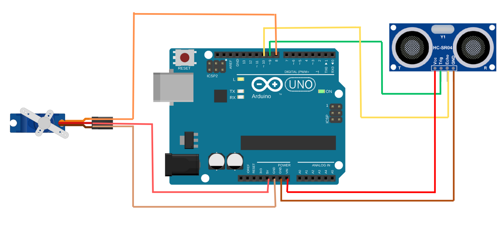

# Ultrasonic-Radar-System

This project simulates a real-time **ultrasonic radar system** using an **Arduino** and a **Processing** visual interface. A servo-mounted ultrasonic sensor scans the environment from 0° to 180°, detecting obstacles and transmitting data to Processing for a dynamic, radar-style visualization.

---

## Features 

-  180° scanning sweep using a servo motor.
-  Real-time object detection with an HC-SR04 ultrasonic sensor.
-  Radar-style Processing interface with:
  - Glowing sweeping sector.
  - Animated pulse wave.
  - Fading red trails for detected objects.
  - On-screen angle and distance display.
-  Audio alert when object is within a predefined distance.

---

## Hardware / Software Requirements 

### Hardware 

- Arduino UNO (or compatible board)
- HC-SR04 Ultrasonic Distance Sensor
- SG90 Servo Motor
- Jumper wires, breadboard
- USB cable for Arduino ↔ PC connection

### Software
- Arduino IDE
- Processing IDE
- High Beep sound file

---
## Circuit Diagram 

| Pin | Connection |
|-----|------------|
| Arduino D9 | HC-SR04 Trig |
| Arduino D10 | HC-SR04 Echo |
| Arduino D8 | Servo signal |
| 5V / GND | Power for sensor and servo |

